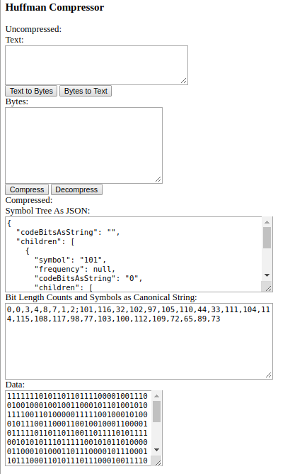

CompressionLibrary
==================

This repo contains experimental work on data compression.

As of this writing, it includes:
- a user interface that allows user data to be compressed with Huffman coding.  

</img>
